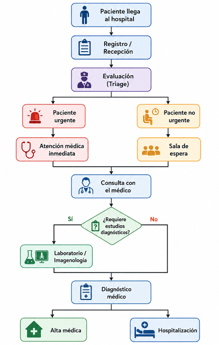

# Hospital Emergency Department Simulation

Discrete-event simulation of a hospital emergency department using Python and SimPy.
<p style="text-align: justify;">
The project models the flow of patients through an emergency department, including patient arrival, registration, triage, medical consultation, laboratory, and diagnostic imaging processes. The model uses the Emergency Severity Index (ESI) to represent patient priority and conditional probabilities to determine the utilization of diagnostic resources.

The main objective is to evaluate different operational scenarios and identify strategies capable of improving emergency department performance.
</p>
---

## Project Objectives

The simulation has the following objectives:

- Model the patient flow through an emergency department.
- Represent patient priority using the Emergency Severity Index (ESI).
- Model hospital resources and their capacity.
- Represent laboratory and imaging utilization through conditional probabilities.
- Estimate patient waiting times and total time in the system.
- Evaluate resource-related bottlenecks.
- Compare alternative operational scenarios.
- Perform multiple simulation replications.
- Support scenario evaluation using statistical analysis.

---

## Methodology

The project uses **Discrete-Event Simulation (DES)** to represent the emergency department as a dynamic system where patient arrivals, service starts, service completions, diagnostic requests, and patient departures occur as discrete events.

The general patient flow is:




## Emergency Severity Index (ESI)
The model uses a five-level ESI classification:

| ESI | Priority | Description |
|---|---|---|
| ESI 1 | 1 | Resuscitation / critical condition |
| ESI 2 | 2 | Emergent / high risk |
| ESI 3 | 3 | Urgent |
| ESI 4 | 4 | Less urgent |
| ESI 5 | 5 | Non-urgent |

The reference input distribution used by the model is:

| ESI | Probability |
|---|---:|
| ESI 1 / Red | 3% |
| ESI 2 / Orange | 5% |
| ESI 3 / Yellow | 42% |
| ESI 4 / Green | 42% |
| ESI 5 / Blue | 8% |
| **Total** | **100%** |
<p style="text-align: justify;">
The distribution is treated as an input parameter and is not considered a universal clinical distribution. It represents the reference population assumed for this simulation.
</p>

### Model Inputs
<p style="text-align: justify;">
The model distinguishes between input parameters, process rules, and simulation outputs.
</p>

#### Input parameters

Examples include:

- Patient arrival rate.
- ESI probability distribution.
- Registration time.
- Triage time.
- Medical consultation time.
- Laboratory request probability by ESI.
- Imaging request probability by ESI.
- Imaging modality probabilities.
- Laboratory processing time.
- Imaging processing time.
- Hospital resource capacities.

#### Process rules

Examples include:

- Patient priority determined by ESI.
- Resource allocation rules.
- Diagnostic resource requirements.
- Patient routing through the emergency department.

#### Simulation outputs

Examples include:

- Patient waiting time.
- Patient time in the system.
- Queue lengths.
- Patients served.
- Laboratory requests.
- Imaging requests.
- Laboratory turnaround time.
- Imaging utilization.
- Resource utilization.
<p style="text-align: justify;">
An important modeling principle is that waiting time is not introduced as an input distribution. It is an endogenous result of the simulation and emerges from the interaction between demand, resource capacity, patient priority, service times, and process rules.
</p>

## Laboratory Model

Laboratory utilization is represented through conditional probabilities based on ESI.

| ESI | Laboratory Probability |
|---|---:|
| ESI 1 | 95% |
| ESI 2 | 76% |
| ESI 3 | 55% |
| ESI 4 | 15% |
| ESI 5 | 2% |

Laboratory processing is represented through several components, including:
- Sample collection.
- Transportation.
- Processing.
- Queue waiting time.
- Total turnaround time (TAT).

The model distinguishes between:

$$ \text{Laboratory TAT} =  \text{Waiting Time} +  \text{Processing / Service Time} $$
<p style="text-align: justify;">
This allows the simulation to determine how much of the total diagnostic turnaround time is generated by congestion and how much corresponds to the actual processing process.
</p>

### Diagnostic Imaging Model

Imaging utilization is also conditioned on ESI.

| ESI | Imaging Probability |
|---|---:|
| ESI 1 | 80% |
| ESI 2 | 75% |
| ESI 3 | 60% |
| ESI 4 | 25% |
| ESI 5 | 0% |

The model represents four imaging modalities:

| Modality | Distribution |
|---|---:|
| X-Ray | 58.3% |
| CT | 30.5% |
| Ultrasound | 6.6% |
| MRI | 4.6% |

<p style="text-align: justify;">
This allows the simulation to represent different diagnostic demand profiles rather than treating imaging as a single homogeneous resource.
</p>

---
### Hospital Resources

The model represents the main resources involved in the emergency department:

- Receptionists.
- Triage nurses.
- Nurses.
- Emergency physicians.
- Consulting rooms.
- Laboratory technicians.
- Imaging technicians.
- Shock area.
- Observation beds.
- Pharmacy staff.

Resource capacity can be modified according to the scenario being evaluated.

---
### Scenarios

Five operational scenarios are currently defined.

| Scenario | Description |
|---|---|
| Scenario 1 | Current operation |
| Scenario 2 | Increase in medical staff |
| Scenario 3 | Fast Track |
| Scenario 4 | Increase in hospital capacity |
| Scenario 5 | Combined strategy |

<p style="text-align: justify;">
The purpose of the scenarios is to evaluate how changes in resources and patient-flow strategies affect system performance.
</p>

---

### Simulation Configuration
The current configuration includes:

```text
Simulation period: 31 days
Warm-up period: 1 day
Replications: 30
Mean interarrival time: 8 minutes
```
<p style="text-align: justify;">
The warm-up period is used to reduce the influence of the initial empty-system condition on the performance measures.
</p>

---

### Performance Metrics
The simulation collects several performance indicators.

#### Patient flow
- Patients arrived.
- Patients served.
- Patients hospitalized.
- Deaths.

#### Waiting times
- Registration waiting time.
- Triage waiting time.
- Consultation waiting time.
- Total patient waiting time.
- Arrival-to-consultation time.

#### System time

Total time between patient arrival and departure from the modeled system.

#### Laboratory
- Laboratory requests.
- Laboratory waiting time.
- Laboratory processing time.
- Laboratory TAT.
- Laboratory TAT without waiting.
- Laboratory TAT percentiles.
- Laboratory requests by ESI.

#### Imaging
- Imaging requests.
- Imaging requests by ESI.
- Imaging modality distribution.
- X-Ray requests.
- CT requests.
- Ultrasound requests.
- MRI requests.

---

### Statistical Analysis
<p style="text-align: justify;">
Because the simulation is stochastic, a single simulation run is not sufficient to evaluate an operational scenario.
The project therefore uses multiple replications.
</p>

The current configuration uses:
```text
30 replications per scenario
```
The results can be compared using statistical methods such as:
- Descriptive statistics.
- Confidence intervals.
- Friedman test.
- Paired t-test.
- Wilcoxon signed-rank test.
- Effect size.

The paired comparison is particularly useful when the same replication seeds are used across scenarios.

---
### Scenario Evaluation
The main performance indicators used for scenario comparison are:
- Average waiting time.
- Average system time.
- Patients served.
- Laboratory requests.
- Diagnostic resource utilization.

Example comparison:

| Scenario | Avg. Waiting Time | Avg. System Time |
|---|---:|---:|
| Current operation | 15.18 min | 73.62 min |
| Increased medical staff | 15.18 min | 73.62 min |
| Fast Track | **3.90 min** | **58.16 min** |
| Increased hospital capacity | 15.18 min | 73.62 min |
| Combined strategy | **3.90 min** | **58.16 min** |

<p style="text-align: justify;">
Under the current model configuration, Fast Track produces the largest reduction in the principal performance indicators.
The results should be interpreted as outcomes of the simulation model and its assumptions rather than as universal conclusions about real-world emergency departments.
</p>

---

## Project Structure

```text
hospital-simulation/
│
├── README.md
├── LICENSE
├── pyproject.toml
│
├── src/
│   ├── __init__.py
│   ├── config.py
│   │
│   ├── business_rules/
│   │   ├── __init__.py
│   │   ├── triage_rules.py
│   │   └── imaging_rules.py
│   │
│   ├── models/
│   │   ├── __init__.py
│   │   ├── patient.py
│   │   ├── patient_status.py
│   │   └── triage_level.py
│   │
│   ├── resources/
│   │   ├── __init__.py
│   │   └── resources.py
│   │
│   ├── scenarios/
│   │   ├── __init__.py
│   │   └── scenarios.py
│   │
│   └── simulation/
│       ├── __init__.py
│       ├── hospital.py
│       ├── metrics.py
│       └── processes.py
│
└── tests/
    └── __init__.py

```
---

### Installation

Clone the repository:
```bash
git clone https://github.com/SidharthaManriquez44/hospital-simulation.git
cd hospital-simulation
```
Create a virtual environment:
```bash
python3 -m venv .venv
```
Activate the virtual environment:
#### macOS / Linux
```bash
source .venv/bin/activate
```
#### Windows
```bash
.venv\Scripts\activate
```
Install the project dependencies:
```bash
pip install -r requirements.txt
```
If dependencies are managed through **`pyproject.toml`**, install the project with:
```bash
pip install -e .
```
### Running the Simulation
Run the main simulation:
```bash
python src/main.py
```
The program reports the main performance indicators and scenario results in the console.

Example:
```text
Hospital Emergency Department Simulation
=============================================

Scenario: Escenario 1 - Operación actual

Patients arrived: 5572
Patients served: 5563
Average waiting time: 15.18 minutes
Average system time: 73.62 minutes
```
---

### Reproducibility
The simulation uses random seeds to allow reproducible experiments.

Example:
```text
simulation = HospitalSimulation(
    scenario=scenario,
    seed=42,
)
```
<p style="text-align: justify;">
For scenario comparisons, the same seed should be used for corresponding replications so that the stochastic variation is controlled and differences between scenarios can be attributed primarily to the changes in the scenario configuration.
</p>

---

### Limitations
The results of the simulation depend on the assumptions and parameters used to construct the model.

Important limitations include:

- Some parameters are derived from published literature rather than hospital-specific historical data.
- The ESI distribution represents a reference input population and is not a universal clinical distribution.
- Conditional probabilities for laboratory and imaging utilization may require calibration with local data.
- Waiting time is an endogenous output of the model.
- The current model does not represent every clinical pathway of a real emergency department.
- Additional validation with historical hospital data is required before using the model for operational decision-making.

---

### Future Work

Future development may include:
- Complete observation-bed modeling.
- Hospitalization pathways.
- Pharmacy processes.
- Shock-area processes.
- Patient discharge and hospitalization probabilities.
- Mortality pathways.
- Left-without-being-seen behavior.
- Additional imaging constraints.
- Resource utilization metrics.
- Confidence intervals for all scenario KPIs.
- Automated statistical analysis.
- Automated visualization of scenario results.
- Calibration using real hospital data.
- Formal model validation with historical observations.

---
### Key Result
<p style="text-align: justify;">
Under the current model assumptions, the Fast Track scenario produced the largest improvement in the principal emergency department performance indicators.
</p>

Compared with the current operation:
```text
Average waiting time
15.18 min → 3.90 min

Reduction ≈ 74.3%
```
and:
```text
Average system time
73.62 min → 58.16 min

Reduction ≈ 21.0%
```
<p style="text-align: justify;">
The statistical analysis of the simulation replications is used to determine whether these observed differences are statistically significant.
</p>

---

### Technologies
- Python
- SimPy
- NumPy / Pandas
- SciPy
- Matplotlib
- Discrete-Event Simulation
- Statistical Analysis
---

### Author

Sidhartha Manriquez

Hospital Emergency Department Simulation

---

### License

This project is licensed under the terms specified in the **[LICENSE](LICENSE)** file.
